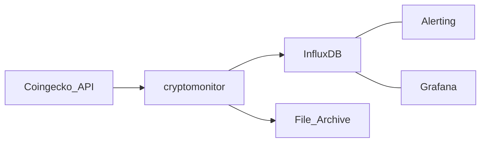

# cryptomonitor

## Overview

The Coin Archiver program is a Python script designed to fetch cryptocurrency data from CoinGecko and archive it either to JSON files on disk or to an InfluxDB instance. The program is configurable through environment variables, allowing for flexibility in its deployment and use.

## Dependencies

- `pycoingecko`: For fetching cryptocurrency data from CoinGecko.
- `yaml`: For loading coin lists from YAML files.
- `dotenv`: For loading environment variables from `.env` files.
- `influxdb_client`: For archiving data to InfluxDB.
- `datetime`, `traceback`, `logging`, `os`, `json`, `sys`: Standard Python libraries for various functionalities.

## Setup

1. Install the required Python packages:

```bash
   pip install pycoingecko pyyaml python-dotenv influxdb_client
```

2. Clone the repository or download the script to your local machine.

3. Set up your environment variables in .env.dev (for development) or .env.prod (for production). The script will load the appropriate .env file based on the TARGET_ENV environment variable.

## Environment Variables

`TARGET_ENV`: Set to either 'dev' or 'prod' to determine which .env file to load.  
`DEBUG`: Set to 'true' to enable debug logging.  
`WORKDIR`: The working directory for the script. This is where the script will look for the coin list YAML file and where it will save JSON archives.  
`FILE_ARCHIVE`: Set to 'true' to enable archiving data to JSON files on disk.  
`INFLUX_ARCHIVE`: Set to 'true' to enable archiving data to InfluxDB.  
`INFLUX_HOST`: The hostname or IP address of your InfluxDB instance.  
`INFLUX_PORT`: The port number for your InfluxDB instance.  
`INFLUX_DB`: The name of the InfluxDB database to write to.  
`INFLUX_USER`: The username for authenticating with InfluxDB.  
`INFLUX_PASS`: The password for authenticating with InfluxDB.  
`INFLUX_BUCKET`: The bucket in InfluxDB to write to.  
`INFLUX_ORG`: The organization in InfluxDB to write under.  

## Usage
Run the script using:

```bash
./coin_archiver.py
```
or
```bash
python3 coin_archiver.py
```

## Functions
`load_yaml(filename)`: Loads a YAML file and returns its content.  
`load_cg_coins(coins, vs_currency)`: Fetches cryptocurrency data from CoinGecko.  
`archive_data_file(dir, data)`: Archives data to JSON files on disk.  
`load_data_file(dir, datetime)`: Loads data from a JSON file on disk.  
`archive_data_influx(data)`: Archives data to InfluxDB.  

## Architecture


## Docker setup

### Building the Docker Image
Ensure you have Docker installed on your machine.
Navigate to the directory containing the Dockerfile and your script.
Build the Docker image using the following command:

```bash 
docker build -t cryptomonitor .
```

### Running the Docker Container
Once the image is built, you can run the Coin Archiver program inside a Docker container using the following command:

```bash
docker run cryptomonitor
```

### Environment Variables with Docker
If your script relies on environment variables, you can pass them to the Docker container using the `-e` flag:

```bash
docker run -e TARGET_ENV=prod cryptomonitor
```
or 
```bash
docker run -e TARGET_ENV=dev cryptomonitor
```

Replace `TARGET_ENV=prod` with your desired environment variable and value.

## Contributing
Feel free to submit pull requests or raise issues if you find any bugs or have suggestions for improvements.
